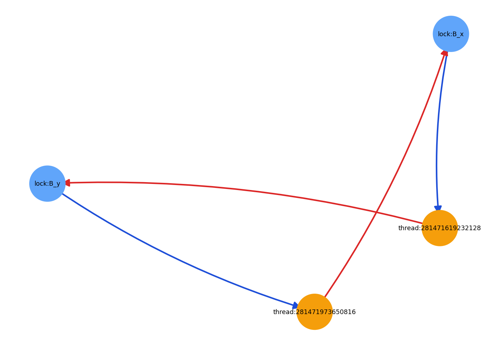
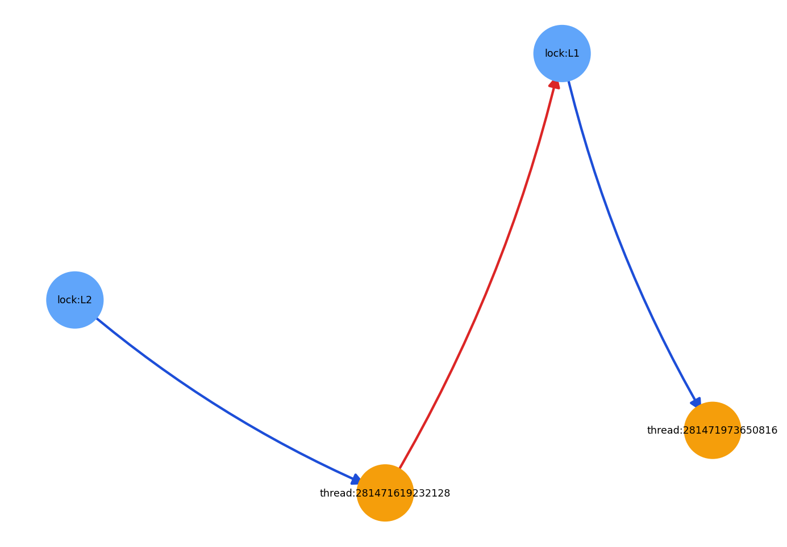

# threadle

[](https://pypi.org/project/threadle/)
[](https://pypi.org/project/threadle/)
[](https://github.com/lucianoramirezs/threadle)
[](https://colab.research.google.com/drive/1pd3hrD7VTbcJjximB4Q84ZkFOctGNzNM?usp=sharing)

**Observabilidad de concurrencia en Python.** threadle modela un **grafo wait-for** (hilos y cerrojos instrumentados), **detecta ciclos** compatibles con deadlock y ofrece **líneas de tiempo** y **gráficos** para razonar sobre contención antes de optimizar a ciegas. Incluye un camino opcional para **asyncio** (dependencias entre tareas, Gantt de tareas).

No intercepta `threading.Lock` anónimos: el estado solo refleja lo que conectas con `TrackedLock`, decoradores y las APIs de trazado. Pensado para servicios con locks explícitos, pruebas de carga reproducibles y depuración de regresiones de diseño.

---

## Highlights

- **Grafo wait-for** — Aristas dirigidas *thread → lock* (espera) y *lock → thread* (posesión); ciclos sobre un `networkx.DiGraph`.
- **Informes** — `DeadlockReport` con resumen legible y JSON estable (`to_json`) para pipelines y tickets.
- **Timeline** — Estados *running* / *waiting* / *holding* y Gantt por hilo; lectura lógica de contención (el **GIL** de CPython sigue aplicando al bytecode).
- **CLI** — `threadle detect`, `snapshot`, `demo` en el **proceso** que importó la librería.
- **Demo** — Tutorial en el repo: [`notebook/demo.ipynb`](https://github.com/lucianoramirezs/threadle/blob/main/notebook/demo.ipynb) (no forma parte del wheel en PyPI).

---

## Instalación

Requiere **Python ≥ 3.11**. Dependencias: `networkx`, `matplotlib`, `matplotlib-inline` (figuras en Jupyter y entornos sin `DISPLAY`).

```bash
pip install threadle
```

```bash
uv add threadle
```

---

## Ejemplo mínimo

```python
import threadle as tl

# Usa TrackedLock en tus hilos en lugar de threading.Lock donde quieras trazabilidad.
lock_a = tl.TrackedLock("A")
lock_b = tl.TrackedLock("B")

# ... tu código ...

tl.analyze_deadlocks()              # DeadlockReport
print(tl.export_debug_bundle_json())  # snapshot completo JSON
```

Para trazado de línea de tiempo y análisis en bloque:

```python
with tl.Session(trace_timeline=True, reset_tracker=False):
    # código instrumentado
    report = tl.analyze_deadlocks()
```

`Session` expone `trace_timeline`, `reset_tracker` (solo tests o demos aislados) y `clear_events_on_enter`.

---

## Conceptos

| Término | Significado |
|:--------|:------------|
| **Instrumentación** | `TrackedLock` + `trace` / `trace_thread` + `Session` y registro de eventos. |
| **Wait-for** | Grafo **dirigido**; relaciones `held_by` y `waits_for` en las aristas cuando el tracker las rellena. |
| **Timeline** | Serie temporal de estados inferidos a partir de trazas; alimenta `visualize_gantt` / `export_gantt`. |

---

## Mapa de la API pública

| Ámbito | API representativa |
|:-------|:-------------------|
| Locks | `TrackedLock` |
| Análisis | `detect_deadlocks`, `analyze_deadlocks`, `DeadlockReport` |
| Exportación | `export_debug_bundle_json`, `export_tracker_state_dict`, `export_debug_bundle_dict` |
| Trazado (threads) | `trace`, `trace_thread`, `Session`, `start_tracing`, `stop_tracing`, `get_events`, `clear_events` |
| Figuras (threads) | `visualize`, `visualize_gantt`, `export_gantt` |
| asyncio | Carga diferida: `start_async_tracing`, `traced_await`, `build_async_dependency_graph`, `visualize_async_gantt`, `export_async_gantt`, … (`threadle.__getattr__`) |

---

## Línea de comandos

El binario `threadle` opera sobre el **mismo proceso** que importó la librería (no es un depurador externo al proceso).

| Comando | Efecto |
|:--------|:-------|
| `threadle detect` | Salida de `detect_deadlocks()`. |
| `threadle detect --json` | JSON de `analyze_deadlocks()`. |
| `threadle snapshot` | `export_debug_bundle_json()` completo. |
| `threadle demo` | Demo de deadlock incluida en el paquete. |
| `threadle demo --visualize -o grafo.png` | PNG del grafo de la demo. |

---

## Visualización

- **`visualize`**: grafo wait-for dirigido (flechas; colores por relación cuando hay metadatos).
- **`visualize_gantt`**: una fila por hilo; paletas `semantic` o `per_thread`.
- **asyncio**: `visualize_async_gantt` y export PNG análogo.

Gantt HTML interactivo (hilos): extra **`plotly`** → `pip install "threadle[plotly]"`.

---

## Outputs de ejemplo

### 1) Wait-for graph (`scenario-b-wait-graph.png`)



Este gráfico muestra el estado de bloqueos en un snapshot puntual:
- **Nodos `thread:*`**: hilos instrumentados.
- **Nodos `lock:*`**: recursos bloqueables (`TrackedLock`).
- **Aristas `thread -> lock`**: el hilo está esperando adquirir ese lock.
- **Aristas `lock -> thread`**: el lock está actualmente en posesión de ese hilo.

Si ves un ciclo dirigido completo (`thread -> lock -> thread -> ...`), tienes evidencia estructural de deadlock en ese instante.

### 2) Demo end-to-end (`showcase-run-demo.png`)



Este output resume un escenario de demo generado por el notebook:
- combina el análisis de deadlock con visualización del estado del sistema,
- sirve como artefacto para documentación, CI y post-mortems,
- es útil para comparar cambios entre versiones (antes/después de un refactor de concurrencia).

### Cómo leer rápidamente las imágenes

- **Mucho `waiting` y pocos cambios de estado**: indica contención sostenida o posible bloqueo.
- **Topología en cadena**: dependencia en serie, potencial cuello de botella.
- **Topología cíclica**: señal fuerte de deadlock (confirmar con `analyze_deadlocks()`).
- **Comparación entre runs**: usa mismos escenarios y evalúa si disminuye el tiempo de espera o se rompe el ciclo.

---

## Funciones y funcionalidades

### Núcleo (threads y locks)

| Función / API | Para qué sirve |
|:--------------|:---------------|
| `TrackedLock` | Lock instrumentado que alimenta el grafo wait-for y el timeline. |
| `trace`, `trace_thread` | Decoradores para registrar ejecución de funciones/hilos con trazabilidad. |
| `Session` | Context manager para activar trazado temporal y análisis en bloque. |
| `start_tracing`, `stop_tracing`, `get_events`, `clear_events` | Control directo del pipeline de eventos. |

### Análisis y diagnóstico

| Función / API | Para qué sirve |
|:--------------|:---------------|
| `detect_deadlocks()` | Detección rápida de ciclo (salida simple). |
| `analyze_deadlocks()` | Reporte estructurado (`DeadlockReport`) con summary y datos enriquecidos. |
| `DeadlockReport.to_json()` | JSON estable para CI, alertas y adjuntos en incidencias. |
| `export_debug_bundle_json()` | Snapshot completo del estado para post-mortem. |

### Visualización y export

| Función / API | Para qué sirve |
|:--------------|:---------------|
| `visualize()` | Grafo wait-for dirigido con flechas. |
| `visualize_gantt()` | Timeline por hilo (running/waiting/holding). |
| `export_gantt()` | Export de gráfico a archivo (PNG/HTML según configuración). |
| `visualize_async_gantt()` | Timeline para tareas asyncio (cuando usas trazado async). |
| `export_async_gantt()` | Export de timeline asyncio a PNG. |

### CLI (operación rápida)

| Comando | Funcionalidad |
|:--------|:--------------|
| `threadle detect` | Resultado directo de detección de ciclo. |
| `threadle detect --json` | Diagnóstico serializable. |
| `threadle snapshot` | Bundle de depuración completo para artefactos. |
| `threadle demo --visualize` | Genera demo + imagen para validar el flujo end-to-end. |

---

## CI, regresiones y post-mortems

`export_debug_bundle_json()` y `DeadlockReport.to_json()` se prestan a artefactos en pipelines, adjuntos en incidencias y comparación de snapshots entre versiones.

---

## Extras

| Extra | Contenido |
|:------|:----------|
| `threadle[plotly]` | Plotly para export HTML del Gantt (donde aplique). |
| `threadle[dev]` | pytest, nbformat, nbclient, ipykernel, nbconvert. |

---

## Desarrollo

```bash
git clone https://github.com/lucianoramirezs/threadle.git && cd threadle
pip install -e ".[dev]"
pytest -q
```

Con **uv**: `uv sync --all-extras` y `uv run pytest -q`.

Regenerar el notebook de demo: `python scripts/generate_notebook_demo.py`. Los artefactos bajo `notebook/outputs/` suelen ignorarse en git; el `.ipynb` vive en el repositorio, no en el wheel de PyPI.

---

## Enlaces

| Recurso | URL |
|:--------|:----|
| Código | [github.com/lucianoramirezs/threadle](https://github.com/lucianoramirezs/threadle) |
| Paquetes | [pypi.org/project/threadle](https://pypi.org/project/threadle/) |
